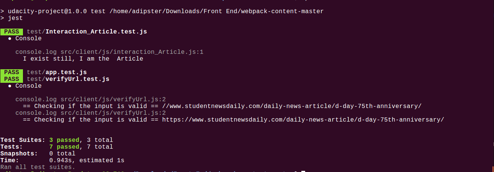
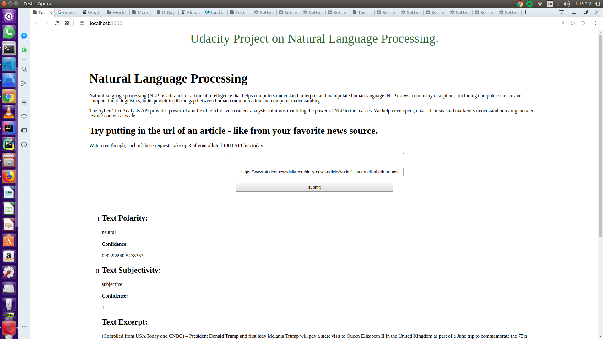

### Evaluate a news article with Natural Language Processing

This project I build a web tool that allows users to run 
Natural Language Processing (NLP) on articles or
blogs found on other websites.

Using an exciting new api called `Aylien`, we can build a simple web interface to interact with their NLP system. 
This tool will give us back pertinent information about the article, 
like whether the content is subjective (opinion) 
or objective (fact-based) and whether it is positive, neutral, or negative in tone.

We used as server `Express` and frond end development tool `Webpack` 

## How to run the project
Clone the github repository.
    
   This will install all the dependencies and development tools required by the project in the target file . They are all 
    present in the `pakage.json` file.

### In Production Mode   
From the route directory in the terminal, run the `npm run build-prod` 
command this will generate the dist folder and cache folders too in a folder `./dist`.
- from the same directory, run `npm run start`
- The site will be accessible from `localhost:3000` from your browser tab.
- From the site you will be able to input your url to be analyzed by aylien.

### In Development Mode
Then run the `npm run build-dev` command still from your terminal, this will lauch your default browser with 
the html file from the views folder.
- The site will be accessible from `localhost:8081` from your browser tab.
- from the same directory, run `npm run start`
  
- From the site you will be able to input your url to be analyzed by aylien.

## Testing

In this project the framework that was  used to test is `jest`.
To run test, move to the root directory from your terminal run the command `npm run test`.

Below is a screenshot of the test results

All the files in the `./src/js` file was tested. Below is a screenshot of the results after running the test command.

## User Interface
When you run the project, this is a view of how the website actually looks like

## Note

The credentials used in setting up the aylien api is supposed to last just for 14 days from the day I created a trial account on Aylien text api.
so if it doesn't work it means my credentials must have surely expired
. So please use the link `https://aylien.com/text-api/` to create an account on Aylien text api and change my credentials in the `app.js` file in the `./server` folder.
